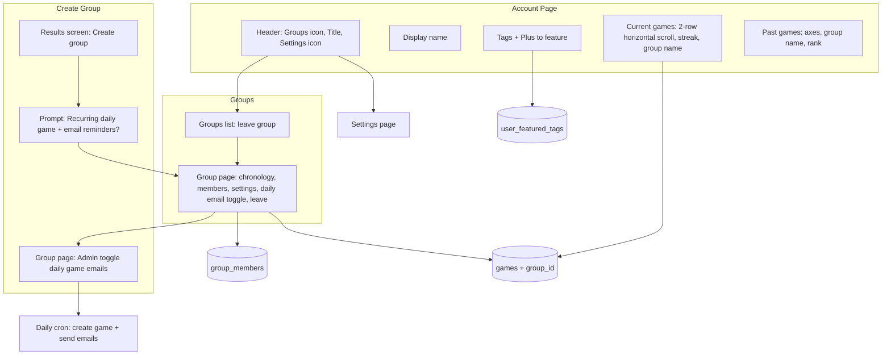

# Account Page and Groups Build Plan

## Current state

- **Profile** ([app/profile/page.tsx](app/profile/page.tsx)): Shows "Account" title, display name, then "Score history" and "Profile records (Extreme consensus)". No header actions, no tags, no current/past games split as specified.
- **Games** ([app/games/page.tsx](app/games/page.tsx)): Lists finished games with rank; no group names, no streaks, no horizontal scroll.
- **Groups**: [saved_groups](supabase/migrations/20260215000000_accounts_saved_groups.sql) stores group metadata (owner, name, settings). Membership is in [group_members](supabase/migrations/20260215100000_groups_and_tags.sql) only (`saved_group_members` was dropped). `group_members` has `player_id` (nullable), `display_name`, `is_anonymous`, `sort_order`, `joined_at`. Used for pre-fill, "Save group" on results, group pages, leave/add/transfer.
- **Games table**: No `group_id`; games are not linked to groups.

---

## 1. Schema and data model

### 1.1 Tags (for account page and future prompts)

- **Source of tags**: From finished games, compute "strong correlation" per axis endpoint (e.g. "Gimli" on X, "Matcha" on Y): e.g. mean of others' guess position toward that endpoint → agreement percentage. Reuse/adapt the existing consensus logic in [app/profile/page.tsx](app/profile/page.tsx) (variance, mean guess) to produce **per-axis-end labels with agreement %** (e.g. "90% Gimli", "100% Matcha").
- **Storage**: Add table **`user_featured_tags`** so the user can pin tags and reorder for context in future prompts:
  - `user_id` (→ players.id), `label` (e.g. "Gimli"), `agreement_pct` (0–100), `game_id` (optional), `source_axis` (e.g. "x" | "y"), `sort_order`, `created_at`.
- **UI**: By default show a few top tags from previous games (computed); Plus icon opens a picker to add/feature more from past games; featured list is persisted in `user_featured_tags`.

### 1.2 Games linked to groups

- Add **`games.group_id`** (nullable, FK → saved_groups.id). When creating a game "from a group" (e.g. from home with a group selected), set `group_id`. Existing and ad-hoc games stay `group_id = null`.
- **Default group name**: Comma-separated list of group member display names (from group_members). If the group has a custom name set in `saved_groups.name`, display that instead. **Any member** can edit the group name (RLS: allow any group member to UPDATE `saved_groups.name`).

### 1.3 Groups as multi-user spaces (members, leave, permissions)

Current design: one owner + a roster of display names. Desired: multiple **members** (users or anonymous), visibility for all members, leave, add/remove, transfer ownership.

- **Table `group_members`** (single source for "who is in the group"; `saved_group_members` has been removed):
  - `group_id`, `player_id` (nullable for anonymous), `display_name`, `is_anonymous` (boolean), `sort_order`, `joined_at`.
  - Owner must appear as a row (e.g. when creating group, insert owner into `group_members`). RLS: members can SELECT group and group_members; INSERT/UPDATE/DELETE per policy below.
- **RLS for `saved_groups`**: Extend so that **any group member** can SELECT (not only owner). **Any group member** can UPDATE the group (at least `name`) so anyone can edit the group name. INSERT/DELETE remain owner-only (or as needed for leave/transfer).
- **`group_members` RLS**: 
  - SELECT: if user is in the group (or is owner).
  - INSERT: owner always; optionally "any member" if `saved_groups.anyone_can_add_members = true`.
  - DELETE: owner always; optionally "any member" if `saved_groups.only_admin_can_remove = false` (or inverse flag: `only_admin_can_remove` so default = only admin).
- **Group settings** (on saved_groups): Add columns e.g. `anyone_can_add_members boolean DEFAULT true`, `only_admin_can_remove boolean DEFAULT true`. Admin UI at bottom of group page toggles these.
- **Transfer ownership**: Three-dot menu on a member row (or on owner row) → "Transfer group ownership" → confirm → update `saved_groups.owner_id` to selected member; ensure that member is in `group_members`.
- **Anonymous members**: `player_id` null, `is_anonymous = true`; show `display_name` + incognito icon. "Most recent display name" can come from last game_players.display_name for that anonymous slot if we ever link; for now, display_name is stored when they're added.

**Done**: `group_members` is the single source of membership. Migration [20260215100000_groups_and_tags.sql](supabase/migrations/20260215100000_groups_and_tags.sql) added `group_members` and backfilled from `saved_group_members`; [20260215200000_drop_saved_group_members.sql](supabase/migrations/20260215200000_drop_saved_group_members.sql) dropped `saved_group_members`. "Save group" (GameResultsView, ResultsView) and "create game from group" use `group_members` only.

### 1.4 Streaks (per-group only)

- **Definition**: Streaks are **per-group**. For a given group: "how many days in a row there has been at least one game played" in that group. So: games where `games.group_id = group.id`, get distinct play dates (e.g. by `created_at` or submissions_lock_at date), ordered by date, then compute longest run of consecutive days. No per-user streak; only group streaks. Can be computed in app (profile current games, group page) or via a DB view/function; no new table.

### 1.5 Recurring daily games and email reminders

- **Storage**: Add to `saved_groups` (or a related table):
  - `daily_game_enabled boolean DEFAULT false` — whether to create/send daily game reminders for this group.
  - Optionally: `daily_reminder_sent_at date` (or a `daily_reminder_log` table) to track last reminder per group and avoid duplicates.
- **Cron / job**: A scheduled job (e.g. Vercel cron, or Supabase Edge Function on schedule) that, for groups with `daily_game_enabled = true`, creates a new game for "today" (using daily axes) and sends reminder emails to members. Members must have an email (linked account) to receive; anonymous members are skipped or get no email.
- **Email**: Use existing or new email path (e.g. Supabase Auth email, or [lib/sms/](lib/sms/) pattern extended for email). Store member email from `auth.users` or `players` if we add optional email there; for group_members with `player_id` set, look up user email.
- **Admin toggle**: On group detail page, at the bottom with other admin settings: "Send daily game email reminders" — enable/disable. Writes to `saved_groups.daily_game_enabled`.

---

## 2. Create group after finishing a game (and recurring daily game option)

- **Where**: Results view (after a game ends). Offer an explicit **"Create a group"** (or "Save as group") action so the user can create a group from the current game’s players. This can be the existing "Save group" flow in [GameResultsView](components/GameResultsView.tsx) or [ResultsView](components/ResultsView.tsx), surfaced clearly as "Create a group from this game."
- **Flow**:
  1. User clicks "Create a group" (or "Save group") on the results screen.
  2. Optional: prompt for group name (or default to member list name).
  3. **New step**: After creating the group, ask **"Create a recurring daily game? We’ll send email reminders to members each day to play."** — [Yes] / [No].
  4. If Yes: set `saved_groups.daily_game_enabled = true` for the new group; optionally trigger or schedule the first daily game/reminder. If No: leave `daily_game_enabled = false`.
- **Group page (admin)**: At the bottom, with other admin settings, add **"Daily game email reminders"** toggle (on/off). When enabled, the cron job includes this group when creating daily games and sending emails; when disabled, the group is skipped.

---

## 3. Account page (profile) layout and behavior

**Route**: Keep `/profile` (or alias "Account" in nav). Redirect to home if not linked (existing behavior).

**Header (top bar)**:
- **Left**: Groups icon (e.g. three people) → links to **Groups list page** (e.g. `/profile/groups` or `/groups`).
- **Center / title**: "Account" or display name as title.
- **Right**: Settings icon → **Settings** (e.g. `/profile/settings`): account settings (display name, email, sign out, delete account, etc.). Can be a simple page or modal; plan assumes a dedicated settings page.

**Below header**:
1. **Display name** (prominent).
2. **Tags section**: 
   - Show featured tags (from `user_featured_tags` plus default top N from past games). Each tag: label + agreement % (e.g. "90% Gimli").
   - Plus icon to open "Add/feature tags" from previous games (list of candidate tags from finished games; user selects to add to featured). Save to `user_featured_tags`.
3. **Current games**:
   - Section title "Current games."
   - Horizontal scroll container; **two rows** that scroll together (e.g. two rows of game cards in one overflow-x-auto).
   - Each card: game axes (or title), **group streak** (e.g. "3-day streak" for that group — streaks are per-group: consecutive days with at least one game in that group). **Group name** on each card: if `game.group_id` set, show group name (comma-separated member list if no custom name); else show "—" or "No group."
4. **Past games**:
   - Section title "Past games."
   - Each entry in order: **Top/Bottom | Left/Right** (axes: e.g. vertical axis labels then horizontal), then **group name**, then **your rank** (e.g. "2nd of 5"). Link to game. Format: e.g. `Gimli–Legolas | Muffin–Pancake · Group Name · 2nd of 5`.

**Data**:
- Current games: games where user is in game_players and `phase = 'placing'` (and optionally recent `results` if you want "active" to include just-ended). Include `group_id` and resolve group name. **Streak**: per-group — for each game's group, compute consecutive days with at least one game in that group; show that group's streak on the card.
- Past games: same as today's score history but with group name and the new display order (axes | group | rank).

---

## 4. Groups list page

**Route**: e.g. `/profile/groups` or `/groups`.

- **Content**: List of groups the user is a **member** of (from `group_members` where `player_id = auth.uid()`; plus groups they own, which are already in group_members as owner).
- Each row: group name (comma-separated member list if no custom name), link to group page, **Leave group** button. Any member (including owner) can leave; when owner leaves, ownership is **auto-assigned** to another member (e.g. oldest by joined_at, or first by sort_order).
- Empty state: "You're not in any groups yet. Save a group from a game result or get invited."

**Nav**: Groups icon on profile → this page. Breadcrumb or back to Profile.

---

## 5. Group detail page

**Route**: e.g. `/groups/[id]`.

**Access**: Only if current user is in `group_members` (or is owner). Else 404 or redirect.

**Layout**:
1. **Chronology of games** (top):
   - **Two rows** that scroll together horizontally.
   - **Active games first** (phase = placing); then past games (results), scroll right. Each game card: date in corner (e.g. top-right), and **winner** shown as name or initials **inside a trophy icon**.
   - Winner = game_players row with highest score for that game.
2. **Members** (below):
   - One row per member. Columns/cells: **Crown icon** for owner/admin; **display name** (anonymous: incognito icon + name); **tags** (their featured or top tags); **games won** (count of games in this group where they won); **Remove** button (visible based on permission: default only admin); **Plus** icon to add member (default: any member can add); **Three-dot menu** with "Remove" and "Transfer group ownership" (transfer only for owner, or only owner sees it).
3. **Settings** (bottom):
   - **Group name**: Any member can edit the group name (default display is comma-separated member list when no custom name is set).
   - Admin-only: **Configurable permissions** — "Anyone can add members" (default on), "Only admin can remove members" (default on). Save to `saved_groups` columns.
   - Admin-only: **Daily game email reminders** — toggle to enable/disable. When enabled, the app (via cron/scheduled job) creates a daily game for this group and sends reminder emails to members; when disabled, no daily emails. Stored in `saved_groups.daily_game_enabled`.
4. **Leave group** button at bottom (all members). When **owner** leaves, **auto-assign** ownership to another member (e.g. oldest by joined_at, or first non-owner by sort_order) so the group is never orphaned.

**Anonymous members**: Stored as `group_members` with `player_id` null, `is_anonymous = true`, `display_name` = most recent or entered name. Show incognito icon next to name; "tags" and "games won" can show "—" or 0 if we don't track by identity.

---

## 6. Navigation and links

- **Top bar (AppNav)**: When the user is linked, show an **account name/icon** in the top bar (e.g. right side) that links to `/profile`. Clicking it from any page takes the user to their account/profile page. This can be the existing account icon + email label made clearly clickable as a single link to `/profile`, or a dedicated "Account" label/avatar; ensure the whole control is one clickable area to profile.
- [AppNav](components/AppNav.tsx): Add **Groups** link (icon or text) next to "My games" / "Profile" when linked; or keep Profile as the account entry and put Groups inside profile (profile page has groups icon → groups list). Spec: "groups icon at top left" of **account page** → groups list; **settings icon top right** → settings.
- Profile link in nav can stay "Profile" or "Account"; ensure it goes to `/profile` (account page).

---

## 7. Implementation order (suggested)

| Step | What |
|------|------|
| 1 | **Schema migration**: `games.group_id`; `group_members` table; RLS for members to read groups; group settings columns (`anyone_can_add_members`, `only_admin_can_remove`, **`daily_game_enabled`**); `user_featured_tags`; backfill from `saved_group_members` then drop `saved_group_members` (app uses only `group_members`). |
| 2 | **Profile header**: Settings icon → `/profile/settings`, Groups icon → `/profile/groups`. **Top bar**: Account name/icon in AppNav that links to `/profile` from anywhere. |
| 3 | **Tags**: Compute candidate tags from past games (axis-end + agreement %); `user_featured_tags` CRUD; tags section on profile with Plus to add featured. |
| 4 | **Streak**: Compute **per-group** streak (consecutive days with at least one game in that group); show on profile current-game cards and on group page. |
| 5 | **Current games section**: Horizontal two-row scroll, game cards with group name and **per-group** streak. |
| 6 | **Past games section**: Reformat to axes \| group name \| rank; link to game. |
| 7 | **Groups list page**: List groups user is in; leave group. |
| 8 | **Group detail page**: Game chronology (active then past, two rows, trophy with winner); members list (crown, tags, games won, add/remove, three-dot/transfer); group settings (permissions **+ daily game email toggle**); leave group. |
| 9 | **Create group from results**: Option on results screen to create a group from the game; after creation, prompt "Create a recurring daily game? We'll send email reminders to members each day."; if Yes set `daily_game_enabled = true`. |
| 10 | **Daily game + email job**: Scheduled job that, for groups with `daily_game_enabled = true`, creates today's game (daily axes) and sends reminder emails to members (with email); admin can turn this off via group page toggle. |
| 11 | **Create game from group**: When creating game from home with group selected, set `games.group_id` and pre-fill from group_members. |

---

## 8. Open decisions / clarifications

- **Tags**: Assumed "tag" = axis-end label (e.g. "Gimli") with agreement % from others' guesses. If you meant a different kind of tag (e.g. free-text), we can adjust.
- **Streak**: Per-group only (no per-user streak). Default group name: comma-separated list of group member names; any member can edit the group name. **Owner leave**: auto-assign ownership to another member when owner leaves (e.g. oldest by joined_at).
- **Daily reminder content**: Email copy and timing (e.g. morning in creator's timezone, or fixed UTC) to be defined; need to store timezone or use a single daily schedule.

---

## 9. Summary diagram

