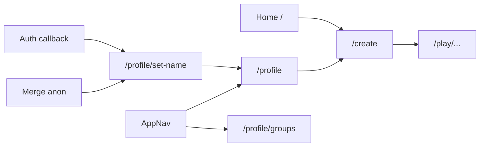

# Account Screen Implementation Plan

Based on [.cursor/plans/Account screen plan](.cursor/plans/Account%20screen%20plan) and [.cursor/plans/ui_guide.md](.cursor/plans/ui_guide.md).

## Design principles (from plan)

- No bounding boxes around the interaction zone (save screen space).
- Headings and text left-justified unless it is the top-level heading (user's name).
- Add some color using ui_guide: Surface `#f4f4f6`, Secondary `#66666e`, Splash `#F9874E`, Accent `#627EF8` (use sparingly).

---

## 1. Settings icon: absolute top-right

**File:** [app/profile/page.tsx](app/profile/page.tsx)

- Wrap the profile content in a container with `position: relative`.
- Change the settings link to be **absolutely positioned** (e.g. `absolute top-4 right-4`). Remove the box styling from the settings link so it is an icon-only link in the corner.

---

## 2. Remove bounding box and apply layout/color on profile

**File:** [app/profile/page.tsx](app/profile/page.tsx)

- Remove or relax the main card wrapper; left-justify section headings and body text (keep only the user's name centered); apply color per ui_guide for actions/links.

---

## 3. Current games: always show a "+ new game" slot

**File:** [app/profile/page.tsx](app/profile/page.tsx)

- In "Current games", always render an extra card with a "+" that links to the new game-creation page (e.g. `/create`).

---

## 4. Split game creation: new page + shared component

- `**components/CreateGameForm.tsx**`: Extract full game-creation form and logic from [app/page.tsx](app/page.tsx).
- `**app/create/page.tsx**`: New route that renders only `<CreateGameForm />` with minimal layout.
- Homepage continues to render `<CreateGameForm />` so the main entry point is unchanged.
- The "+" slot on profile links to `/create`.

---

## 5. Remove "My games" page and update links

- Remove "My games" link from [components/AppNav.tsx](components/AppNav.tsx); change "My games" in [components/GameResultsView.tsx](components/GameResultsView.tsx) to `href="/profile"`; redirect `/games` to `/profile` (e.g. in [app/games/page.tsx](app/games/page.tsx) or via Next config).

---

## 6. Optional: AccountPrompt

- Consider softening the bordered box on [components/AccountPrompt.tsx](components/AccountPrompt.tsx) per "no bounding boxes."

---

## 7. Collect display name at account creation (new)

Ensure we collect a display name when the user first gets an account, with smart prefilling.

### 7.1 When to show name collection

- **After first sign-in** when the account has no `players.display_name` (or it’s empty). This covers:
  - New **email signup**: user confirms email, lands on app; no player row or empty display_name.
  - New **Google sign-in**: user completes OAuth, lands on app; no player row or empty display_name.
  - **After merge** (anon → linked): merge already copies anon’s `display_name` into the linked user. If we still want a “confirm your name” moment, we can show the step prefilled; otherwise skip if `display_name` is already set.

**Recommended:** Show a dedicated “Set your name” step only when the signed-in user has no `players.display_name` (or null/empty). After merge, the merge API already sets it from the anon player, so often no extra step is needed.

### 7.2 Where to implement

- **Option A – Dedicated route:** Add e.g. `app/profile/set-name/page.tsx` or `app/onboarding/name/page.tsx`. After auth callback (and after any merge), redirect to this page when `players.display_name` is missing; form submits to update `players.display_name` then redirects to profile or home.
- **Option B – Modal / inline:** A global checker (e.g. in layout or a wrapper component) detects “user signed in but no display_name”; show a modal or inline prompt to set name, then save and dismiss.

Use **Option A** for a clear, accessible flow and a shareable “finish setup” URL.

### 7.3 Auto-populate from last game

- **From anonymous merge:** The merge API ([app/api/account/merge/route.ts](app/api/account/merge/route.ts)) already copies `display_name` from the anonymous `players` row to the linked user when the linked user has none. So “last game” name is already applied when they merge. No extra prefill needed for that case.
- **For the name-collection UI:** When showing the “Set your name” form, prefill the input by:
  1. **If we have a pending merge and know the anon display name:** pass it to the client (e.g. merge response could return `suggestedDisplayName`) and prefill. Optional enhancement.
  2. **Else:** use the **most recent display name** from the current user’s own gameplay: query `game_players` for rows where `player_id = user.id`, order by `claimed_at` or game `created_at` desc, take the first `display_name`. Use that to prefill so “last game” name is used when there was no merge (e.g. they signed in with Google and had no anon play).

So: **auto-populate from last game** = (1) after merge, name is already set by API; (2) on the name-collection page, prefill from merge-suggested name if available, otherwise from latest `game_players.display_name` for this user.

### 7.4 Google: use Google account display name

- **Supabase** exposes the Google profile in `user.user_metadata` (e.g. `user_metadata.full_name` or `user_metadata.name`). After OAuth callback, the client can read `supabase.auth.getUser()` and use `user?.user_metadata?.full_name ?? user?.user_metadata?.name` as the default for the display name field.
- **Name-collection page/component:** On load, if the provider is Google and we don’t already have a `players.display_name`, set the input’s default value to the Google display name. User can edit before saving. Optionally, if we’re confident (e.g. new user, no anon merge), we could auto-save Google’s name and skip the step, but showing the form with Google name prefilled is safer and lets them correct.

**Implementation details:**

- In the set-name page (or modal): `useEffect` to load current user; if `user?.user_metadata?.full_name` or `user?.user_metadata?.name`, use it as initial state for the name input (only if we don’t already have a better value from “last game” or merge).
- Prefill priority: (1) merge-suggested or existing `players.display_name`, (2) latest `game_players.display_name` for this user, (3) Google `user_metadata.full_name` / `name`, (4) empty.

### 7.5 Email signup

- Email signup does not return to the app with form data (user confirms via email link). So we **cannot** collect the name in the signup modal and persist it before confirmation. We **can**:
  - After they click the confirmation link they land on the app (via `/auth/callback`). Then the same “no display_name” logic applies: redirect to the set-name page and prefill from (2) or (4) above (no Google name; “last game” only if they had anon play that was merged).

### 7.6 Summary of changes

| Area                           | Change                                                                                                                                                                                                                                           |
| ------------------------------ | ------------------------------------------------------------------------------------------------------------------------------------------------------------------------------------------------------------------------------------------------ |
| **New route**                  | `app/profile/set-name/page.tsx` (or `app/onboarding/name/page.tsx`) – form to set `players.display_name`; redirect here when user is signed in but has no display_name (e.g. after callback or after merge).                                     |
| **Auth callback / post-merge** | Client-side: after session is established (and after merge if any), check `players.display_name`; if missing, redirect to set-name page. Can live in layout, AuthMergeChecker (after merge + reload), or a small “onboarding” checker component. |
| **Set-name page**              | Prefill: (1) merge-suggested if available, (2) else latest `game_players.display_name` for this user, (3) else Google `user_metadata.full_name`/`name`, (4) else blank. Save to `players.display_name`, then redirect to profile or home.        |
| **Merge API**                  | Optional: return `suggestedDisplayName` in merge response so client can prefill set-name step when we show it after merge (currently we copy server-side and reload; if we redirect to set-name for “confirm name,” we can pass that).           |
| **AuthModal**                  | No need to add a name field for email signup (won’t persist through confirmation). Optional: add a “Display name” field for in-session sign-in flows if we ever want to set it before redirect; for now, set-name page is sufficient.            |

---

## Summary diagram

- New users (or users with no display_name) are sent to set-name after auth or merge; prefilled from last game or Google; then continue to profile or home.

