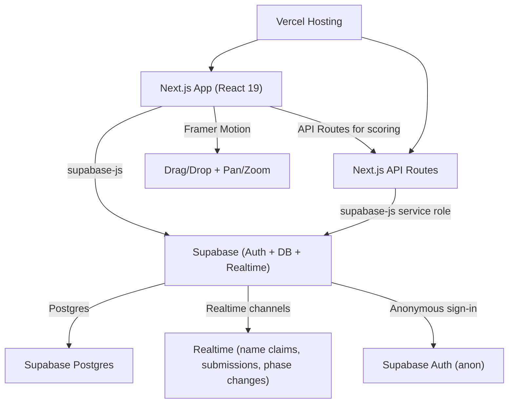
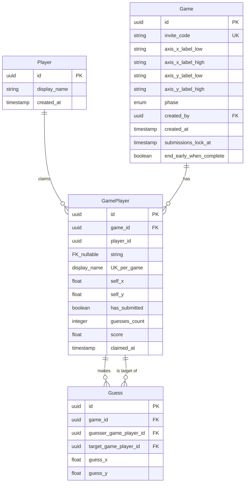
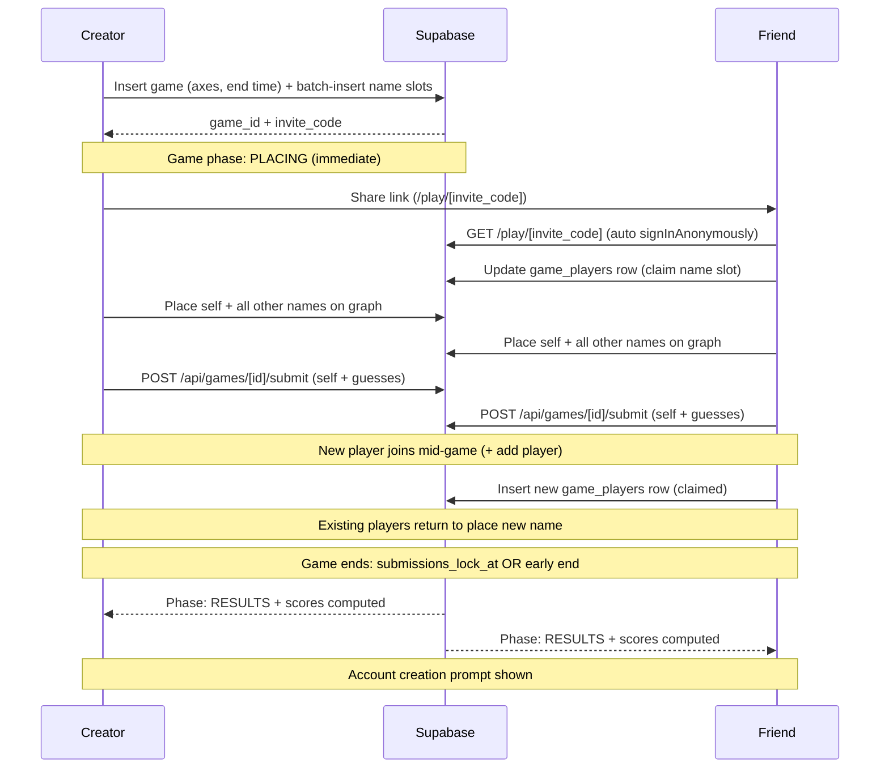

# Friend Place — Full Build Plan

We’re building a daily online game in the style of wordle, except it is about connecting with your friends.

## Current implementation (as of feature/host-controls)

- **Phases 2-3 done:** Game creation, name claiming, 2D graph with pan/zoom, token tray, self + friend placement, partial submit (delete + re-insert guesses), re-entry to continue placing. Realtime on `game_players` and `games`.
- **Name identity:** Token shows user display name (not "YOU"). **Edit name** updates `display_name` for same slot; **Switch name** unclaims slot and returns to name picker. RLS allows unclaim via migration `20260214200000_allow_unclaim.sql`.
- **Host controls:** Creator can **end game** (set `phase = 'results'`) from dashboard and game info panel. RLS: "Creator can update game". Everyone sees **placement counts** per player (`game_players.guesses_count`); migration `20260214300000_host_controls.sql` adds column and games UPDATE policy.
- **Phase 4 partial:** Submit is client-side (no API submit route). Host can end game manually; no cron for time-based end. Scoring not implemented.

---

Users can form a game and invite others. The game features a 2d graph with two silly axes (i.e. Gimli to Legolas and Muffin to Pancake). Each player sets their name, then puts themselves on the graph. Then, they place each of their friends who are also in the game.

After the game period has ended (usually the end of the day) players earn points for how accurately they placed each of their friends (closeness to how that friend placed themselves), and players get a small amount of points for their friends guessing their placement accurately.

Key elements of the user flow:

- Because people play the game throughout the day and check back in later to see how they scored, we need to keep track of who is who. However, we don’t want to force people to create an account before they start playing—they should be able to just click a link and go.
- Players drag and drop their friends onto the map. Our tech stack needs to support smooth, responsive dragging, panning, and zooming on the map. Gamefeel is key.

## Core User Flow

Player sets up a game. 

To set up a game, they give the names of each person that they want to play with, then send a lobby link to all their friends. As each player joins, they can select the name that they are from the list (this is then removed from the list of options- and they can rename themselves if needed).

Players place each name that has been specified for the game. New users can also join via the link (+ add player option) -> users can come back to the game throughout the day to place new users that have joined.

The game ends after a specified time (usually at midnight in the creator's timezone), at which point navigating to the link shows the score screen. By default, the game also ends early after all names have been claimed and all users have made placements- this can be unchecked in game setup config. 

Users are prompted to make an account at this time so they can easily recreate game groups + save their score history.

## Architecture Overview




---

## 1. Tech Stack

### Frontend

- **Next.js 16 (App Router)** — already scaffolded
- **React 19 + Tailwind CSS 4** — already installed
- **Framer Motion** — smooth drag-and-drop, spring physics, gesture handling for placing friends on the map
- `**@use-gesture/react**` — pan and pinch-to-zoom on the 2D graph canvas
- **Canvas approach:** Use a plain `<div>` coordinate space (CSS transforms for zoom/pan) with Framer Motion `<motion.div>` draggable tokens. This is simpler than PixiJS/Canvas and gives excellent gamefeel with spring animations, snap-to-release, and momentum. If performance becomes an issue with many players, we can migrate to PixiJS later.

### Backend — Supabase (all-in-one)

Supabase replaces several separate services by providing Postgres, Auth, Realtime, and a REST/RPC API in one platform:

- **Supabase Postgres** — the database. Tables defined via SQL migrations managed with the Supabase CLI. We query directly from the client using `supabase-js` (with RLS protecting data) and from server-side API routes using the service-role key for privileged operations like scoring.
- **Supabase Auth (Anonymous sign-in)** — Supabase supports [anonymous sign-in](https://supabase.com/docs/guides/auth/auth-anonymous). When a user visits a game link, we call `supabase.auth.signInAnonymously()`. This creates a persistent session (stored in localStorage by `supabase-js`) with a real `auth.uid()` that RLS policies can reference. No email, no password, no friction. Users can later link an email/OAuth provider to "claim" their account.
- **Supabase Realtime** — subscribe to Postgres changes on the `game_players` table to get live updates: "X claimed a name," "X has submitted," and new player additions. Subscribe to the `games` table to detect phase transitions (e.g., game ends → `results`). No polling needed, no third-party service.
- **Supabase RPC (Postgres functions)** — for the scoring calculation, we can use a Postgres function called via `supabase.rpc('calculate_scores', { game_id })` to atomically compute scores server-side when the last player submits.

### API Routes (minimal)

- **Next.js Route Handlers** (`app/api/`) — only needed for logic that shouldn't run client-side: score computation (uses service-role key), game end transitions (time-based or early-end), and any future webhooks. Most reads and writes go directly through `supabase-js` from the client, protected by RLS.

### Deployment

- **Vercel** — hosting, serverless functions, environment variables
- **Supabase** — managed Postgres, auth, realtime (free tier is generous: 500MB DB, 50K monthly active users, unlimited API requests)

---

## 2. Data Model




Key design decisions:

- `**Game.phase**`: enum of `placing` | `results`. There is no `lobby` phase — the game enters `placing` immediately upon creation. The `/play/[inviteCode]` page handles name selection before showing the graph.
- `**Game.invite_code**`: short, human-friendly code (e.g., 6 alphanumeric chars) for sharing.
- `**Game.submissions_lock_at**`: the deadline after which the game transitions to `results` (default: midnight in the creator's timezone, computed client-side and stored as an absolute timestamp).
- `**Game.end_early_when_complete**`: boolean (default `true`). When enabled, the game also ends early once all name slots are claimed and all players have submitted placements.
- **Name slot pattern**: The creator pre-populates `game_players` rows at game creation time, one per friend name. These rows have `player_id = NULL` until a real user claims them by selecting the name. This means `GamePlayer.player_id` is **nullable** — a `NULL` value means the name slot is unclaimed.
- `**GamePlayer.display_name**`: unique per game (`UNIQUE(game_id, display_name)`). Set by the creator at game creation; the claiming player can rename themselves if needed.
- `**GamePlayer.claimed_at**`: nullable timestamp, set when a user claims the name slot (replaces `joined_at`).
- **Coordinates** are normalized floats (0.0 to 1.0) so they're resolution-independent.
- `**Guess**` references `game_players(id)` for both `guesser_game_player_id` and `target_game_player_id` (not `players(id)`), since targets may be unclaimed name slots with no entry in the `players` table. One row per (guesser, target) pair per game.
- `**GamePlayer.score**`: computed server-side when game transitions to results. Nullable float.
- `**Player.id**` maps to `auth.uid()` from Supabase Auth (anonymous or linked account).

### Row Level Security (RLS) Policies

RLS is critical since clients talk directly to Supabase:

- `**games**`: Anyone can `SELECT`. Authenticated users can `INSERT` (create games, `created_by = auth.uid()`). **Creator can `UPDATE`** (e.g. set `phase = 'results'` to end game) via policy "Creator can update game".
- `**game_players**`:
  - `SELECT`: Anyone authenticated can read all game player rows.
  - `INSERT`: Creator can insert unclaimed name slots; any authenticated user can insert a row with `player_id = auth.uid()` ("+ add player").
  - `UPDATE`: Claim unclaimed row, or update own row (self-placement, display name, submission, `guesses_count`). **Unclaim:** policy allows setting `player_id = NULL` on own row (migration `20260214200000_allow_unclaim.sql`).
- `**guesses**`: Players can `INSERT`, `UPDATE`, and **`DELETE`** their own guesses (for replace-all on submit). Players can `SELECT` their own guesses during placing (for re-entry) or all guesses in `results` phase. See migration `20260214100000_fix_guesses_rls.sql`.
- Service-role key bypasses RLS for scoring and phase transitions in API routes.

---

## 3. Game Flow & API Routes




### What runs where

**Direct client-to-Supabase (via `supabase-js`, protected by RLS):**

- Create game — `supabase.from('games').insert(...)` + `supabase.from('game_players').insert([...name slots...])`
- Claim a name — `supabase.from('game_players').update({ player_id: auth.uid() }).eq('id', slot_id)`
- Add new player mid-game — `supabase.from('game_players').insert({ game_id, player_id: auth.uid(), display_name })`
- Read game state — `supabase.from('games').select('*, game_players(*)')`
- Read results — `supabase.from('games').select('*, game_players(*), guesses(*)')` (RLS restricts guesses to results phase)
- Realtime — subscribe to `game_players` table for live claim updates, new player additions, and submission status

**Next.js API Routes (server-side, uses service-role key):**

- `POST /api/games/[id]/submit` — Submit self-placement + guesses; if `end_early_when_complete` is true and all names claimed + all players submitted, transition to `results` and compute scores
- `POST /api/games/[id]/end` — Time-based game end: triggered by a Vercel Cron job (or client-side check on page load) when `submissions_lock_at` has passed; transitions game to `results` and computes scores

---

## 4. Scoring Algorithm

- **Guess accuracy** = `1 - euclidean_distance(guess, target_self_placement)` (clamped to 0). Since coords are 0-1, max distance is ~1.41. Normalize so a perfect guess = 100 points.
- **Points for guesser**: Points proportional to accuracy for each name guessed.
- **Points for target**: Small bonus (e.g., 20% of the accuracy score) when a friend guesses them accurately. This rewards being "predictable" / self-aware.
- Total score = sum of guesser points + sum of target bonuses.

**Edge cases for the new flow:**

- **Unclaimed name slots** (name was pre-populated but nobody claimed it): excluded from scoring entirely — no `self_x`/`self_y` to score against, so guesses for that target earn 0 points and are not penalized.
- **Claimed but not submitted**: A player who claimed a name and placed themselves but never submitted guesses scores 0 as a guesser. They can still be a target if they placed themselves (i.e., their `self_x`/`self_y` are set).
- **Late joiners**: Players added mid-game via "+ add player" are included in scoring. Existing players who return to place the new name can update their guesses (upsert).

---

## 5. Page Structure


| Route                        | Page           | Description                                                        |
| ---------------------------- | -------------- | ------------------------------------------------------------------ |
| `/`                          | Home / Landing | "Create a Game" form: axis labels, player names, end time, config  |
| `/play/[inviteCode]`         | Game page      | Dynamic — shows name selection, placing, or results                |
| `/play/[inviteCode]/results` | Results page   | Scoreboard, animated reveal of placements, account creation prompt |


The `/play/[inviteCode]` page is the core — it conditionally renders based on game state and user state:

1. **Name selection** (user hasn't claimed a name, game is `placing`): Show list of unclaimed names from the pre-populated slots. User picks their name (removed from the list). They can rename themselves if needed. Also shows a "+ add player" option for names the creator missed.
2. **Placing** (user has claimed a name, game is `placing`): The 2D graph. Player places themselves, then drags every other name in the game onto the graph. If new players are added mid-game, the user is prompted to return and place them.
3. **Results** (game phase is `results`): Animated scoreboard, overlay showing where everyone placed themselves vs. where others guessed. Users are prompted to create an account to save their score history and easily recreate game groups.

---

## 6. The 2D Graph (Core UX)

This is the most critical piece for gamefeel:

- **Container**: A `<div>` with CSS `transform: scale(zoom) translate(panX, panY)` controlled by `@use-gesture/react` for pinch-zoom and pan gestures
- **Axes**: Drawn with Tailwind-styled divs — crosshair lines at 50%, labels at extremes (e.g., "Gimli" on left, "Legolas" on right)
- **Player tokens**: `<motion.div>` from Framer Motion with `drag` enabled, spring physics on release, and snap constraints to stay within bounds
- **Self-placement**: A distinct colored token the player drags to place themselves
- **Placing others**: Every other name in the game (claimed and unclaimed) appears as a named token in a "tray" below the graph; the player drags them onto the graph to guess their position
- **Visual feedback**: Tokens glow/pulse when dragged, snap with a satisfying spring, subtle haptic-style scale animation on drop

---

## 7. Packages to Install

```
npm install @supabase/supabase-js @supabase/ssr framer-motion @use-gesture/react nanoid
```

- `@supabase/supabase-js` — Supabase client (auth, DB queries, realtime subscriptions, RPC calls)
- `@supabase/ssr` — helper for creating Supabase clients in Next.js server components and route handlers (handles cookie-based session for SSR)
- `framer-motion` — drag/drop, animations, springs
- `@use-gesture/react` — pan/zoom gestures
- `nanoid` — generate short invite codes

Also install the Supabase CLI globally for managing migrations:

```
npm install -D supabase
```

---

## 8. File Structure

```
app/
  layout.tsx                  (root layout, global styles)
  page.tsx                    (landing page — game creation form)
  play/
    [inviteCode]/
      page.tsx                (main game page — name selection / placing / results)
  api/
    games/
      [id]/
        submit/route.ts       (POST: submit placements, trigger scoring + early end check)
        end/route.ts          (POST: time-based game end, compute scores — called by cron or client)
components/
  GameGraph.tsx               (the 2D coordinate graph with pan/zoom)
  PlayerToken.tsx             (draggable token for self + others)
  TokenTray.tsx               (tray of name tokens to drag onto graph)
  GameSetup.tsx               (game creation form: axes, player names, end time, config)
  NameSelector.tsx            (UI for claiming a name from the pre-populated list + add player)
  PlacingPhase.tsx            (the placing step: self-placement + guessing others)
  Results.tsx                 (scoreboard, placement reveal)
  ScoreCard.tsx               (individual score breakdown)
  AccountPrompt.tsx           (post-game prompt to link anonymous account to email/OAuth)
lib/
  supabase/
    client.ts                 (browser Supabase client)
    server.ts                 (server-side Supabase client via @supabase/ssr)
    middleware.ts              (refresh session cookie on each request)
    admin.ts                  (admin client using service-role key)
  scoring.ts                  (scoring algorithm — called from API route)
  utils.ts                    (shared utilities)
  types.ts                    (TypeScript types generated from Supabase schema)
supabase/
  config.toml                 (Supabase CLI config)
  migrations/
    001_initial_schema.sql    (tables, RLS policies, Postgres functions)
middleware.ts                 (Next.js middleware — calls Supabase session refresh)
```

Note: Most reads and writes go directly through `supabase-js` from the client, protected by RLS (game creation, name claiming, reading game state, reading results). Only privileged operations (scoring, phase transitions) need API routes with the service-role key. The `start` route has been removed — games enter `placing` phase immediately upon creation.

---

## 9. Implementation Order

The build is broken into 6 phases, each producing a working increment:

### Phase 1: Supabase + Auth Foundation

- Create Supabase project (via dashboard or CLI)
- Write SQL migration (`supabase/migrations/001_initial_schema.sql`) defining all tables, enums, indexes, and RLS policies
- Enable anonymous sign-in in Supabase Auth settings
- Create Supabase client helpers: `lib/supabase/client.ts` (browser), `lib/supabase/server.ts` (SSR/API routes via `@supabase/ssr`)
- Set up Next.js `middleware.ts` to refresh the Supabase session cookie on each request
- Generate TypeScript types from the Supabase schema (`npx supabase gen types typescript`)
- Set environment variables: `NEXT_PUBLIC_SUPABASE_URL`, `NEXT_PUBLIC_SUPABASE_ANON_KEY`, `SUPABASE_SERVICE_ROLE_KEY`

### Phase 2: Game Creation + Name-Claiming Join Flow

- Landing page (`/`) with `GameSetup` form: axis labels, list of player names, end time (default: midnight tonight), "end early when complete" toggle
- Form inserts into `games` table (phase defaults to `placing`) + batch-inserts `game_players` rows as name slots (with `player_id = NULL`) — all via `supabase-js`
- Creator is auto-signed-in anonymously and auto-claims their own name slot
- `/play/[inviteCode]` page — auto-triggers `signInAnonymously()` if no session, then fetches game by invite code
- `NameSelector` component: show unclaimed name slots, user picks their name (claims the slot by setting `player_id`). User can rename themselves. Also shows "+ add player" button to insert a new `game_players` row mid-game.
- Player list sidebar showing who has claimed which name (claimed vs. unclaimed visual distinction)
- Share link UI (copy invite URL to clipboard)
- Subscribe to Supabase Realtime on `game_players` table to show live claim updates and new player additions

### Phase 3: The 2D Graph (Core Experience)

- Build `GameGraph` component with pan/zoom via `@use-gesture/react`
- Build `PlayerToken` with Framer Motion drag
- Build `TokenTray` for all name tokens (not just friends — every other name in the game)
- Wire up self-placement and name-guessing UX
- Tune spring physics and visual feedback for gamefeel

### Phase 4: Submission + Game Ending

- `POST /api/games/[id]/submit` — server-side route that: persists self-placement + guesses (as upserts to allow updating), checks if `end_early_when_complete` is true and all names are claimed and all players have submitted — if so, transitions game to `results` and computes scores
- `POST /api/games/[id]/end` — server-side route for time-based game end: checks `submissions_lock_at`, transitions to `results`, computes scores. Called by a Vercel Cron job or triggered client-side on page load when deadline has passed.
- Scoring algorithm in `lib/scoring.ts` (called server-side with service-role access to read all placements)
- Scores written back to `game_players.score` column
- Realtime subscription on `games` table detects phase change to `results`, triggering UI transition
- Support partial submissions — players can submit now and return later to place newly-added players (guesses are upserted, not replaced)

### Phase 5: Results UI

- Scoreboard with rankings
- Animated reveal: show where each player placed themselves, then show where others guessed
- Visual comparison (lines from guess to actual position, color-coded by accuracy)
- `AccountPrompt` component: prompt users to link their anonymous account to email/OAuth (via `supabase.auth.updateUser()` or `linkIdentity()`) so they can save score history and easily recreate game groups

### Phase 6: Polish + Deploy

- Mobile responsiveness (touch gestures, responsive layout)
- Error handling, loading states, edge cases (unclaimed names, late joiners, expired games)
- Vercel deployment configuration + Supabase environment variables
- Vercel Cron job for transitioning games past `submissions_lock_at`
- OG image / share metadata for invite links
- Optional: Supabase Edge Function or Vercel Cron for daily axis pair generation

