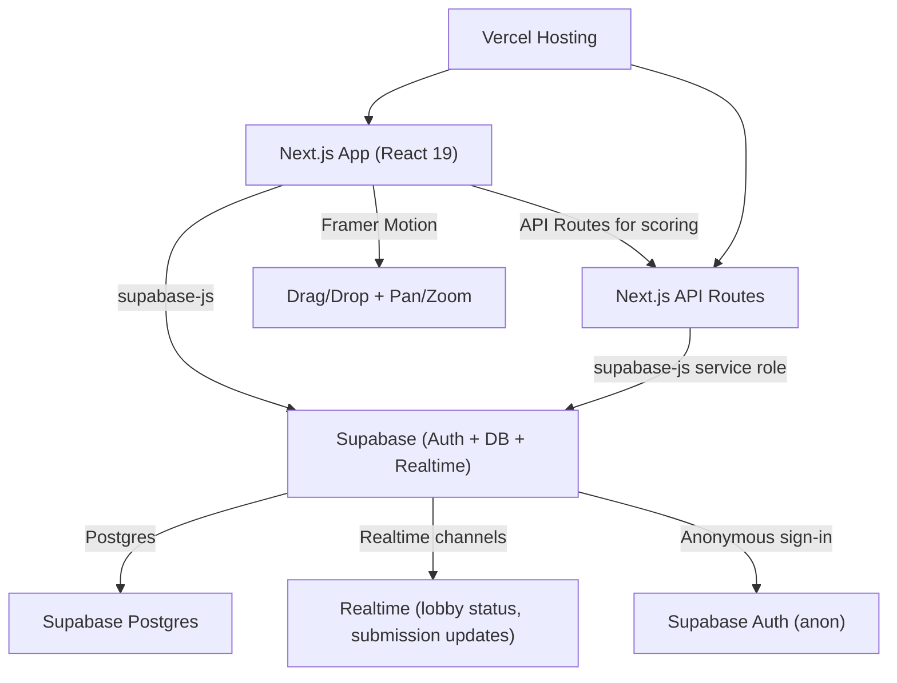
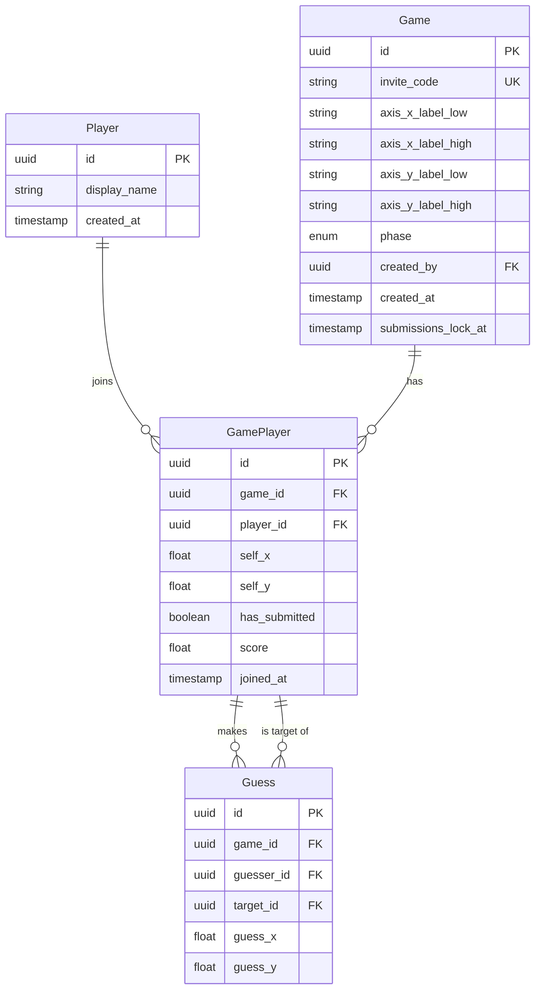
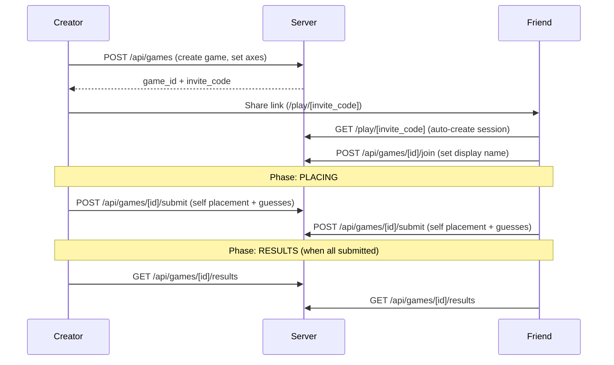

# Friend Place — Full Build Plan

## Architecture Overview




---

## 1. Tech Stack

### Frontend

- **Next.js 16 (App Router)** — already scaffolded
- **React 19 + Tailwind CSS 4** — already installed
- **Framer Motion** — smooth drag-and-drop, spring physics, gesture handling for placing friends on the map
- `**@use-gesture/react**` — pan and pinch-to-zoom on the 2D graph canvas
- **Canvas approach:** Use a plain `<div>` coordinate space (CSS transforms for zoom/pan) with Framer Motion `<motion.div>` draggable tokens. This is simpler than PixiJS/Canvas and gives excellent gamefeel with spring animations, snap-to-release, and momentum. If performance becomes an issue with many players, we can migrate to PixiJS later.

### Backend — Supabase (all-in-one)

Supabase replaces several separate services by providing Postgres, Auth, Realtime, and a REST/RPC API in one platform:

- **Supabase Postgres** — the database. Tables defined via SQL migrations managed with the Supabase CLI. We query directly from the client using `supabase-js` (with RLS protecting data) and from server-side API routes using the service-role key for privileged operations like scoring.
- **Supabase Auth (Anonymous sign-in)** — Supabase supports [anonymous sign-in](https://supabase.com/docs/guides/auth/auth-anonymous). When a user visits a game link, we call `supabase.auth.signInAnonymously()`. This creates a persistent session (stored in localStorage by `supabase-js`) with a real `auth.uid()` that RLS policies can reference. No email, no password, no friction. Users can later link an email/OAuth provider to "claim" their account.
- **Supabase Realtime** — subscribe to Postgres changes on the `game_players` table to get live updates: "X joined the lobby," "X has submitted," and auto-transition to results when everyone is done. No polling needed, no third-party service.
- **Supabase RPC (Postgres functions)** — for the scoring calculation, we can use a Postgres function called via `supabase.rpc('calculate_scores', { game_id })` to atomically compute scores server-side when the last player submits.

### API Routes (minimal)

- **Next.js Route Handlers** (`app/api/`) — only needed for logic that shouldn't run client-side: score computation (uses service-role key), game phase transitions, and any future webhooks. Most reads and writes go directly through `supabase-js` from the client, protected by RLS.

### Deployment

- **Vercel** — hosting, serverless functions, environment variables
- **Supabase** — managed Postgres, auth, realtime (free tier is generous: 500MB DB, 50K monthly active users, unlimited API requests)

---

## 2. Data Model




Key design decisions:

- `**Game.phase**`: enum of `lobby` | `placing` | `results`. Controls what UI to show.
- `**Game.invite_code**`: short, human-friendly code (e.g., 6 alphanumeric chars) for sharing.
- **Coordinates** are normalized floats (0.0 to 1.0) so they're resolution-independent.
- `**Guess**` stores where guesser thinks target placed themselves. One row per (guesser, target) pair per game.
- `**GamePlayer.score**`: computed server-side when game transitions to results. Added as a nullable float column.
- `**Player.id**` maps to `auth.uid()` from Supabase Auth (anonymous or linked account).

### Row Level Security (RLS) Policies

RLS is critical since clients talk directly to Supabase:

- `**games**`: Anyone can `SELECT` (read game info). Only authenticated users can `INSERT` (create games).
- `**game_players**`: Players can `SELECT` all players in games they belong to. Players can `INSERT` themselves (join). Players can `UPDATE` only their own row (set display name, self-placement).
- `**guesses**`: Players can `INSERT` their own guesses. Players can only `SELECT` guesses in games that are in `results` phase (prevents peeking).
- Service-role key bypasses RLS for scoring and phase transitions in API routes.

---

## 3. Game Flow & API Routes




### What runs where

**Direct client-to-Supabase (via `supabase-js`, protected by RLS):**

- Create game — `supabase.from('games').insert(...)`
- Join game — `supabase.from('game_players').insert(...)`
- Set display name — `supabase.from('game_players').update(...)`
- Read game state — `supabase.from('games').select('*, game_players(*)')`
- Read results — `supabase.from('games').select('*, game_players(*), guesses(*)')` (RLS restricts guesses to results phase)

**Next.js API Routes (server-side, uses service-role key):**

- `POST /api/games/[id]/start` — Creator starts game (validates creator, transitions phase)
- `POST /api/games/[id]/submit` — Submit placements + guesses, check if all players done, compute scores and transition to results if so

---

## 4. Scoring Algorithm

- **Guess accuracy** = `1 - euclidean_distance(guess, target_self_placement)` (clamped to 0). Since coords are 0-1, max distance is ~1.41. Normalize so a perfect guess = 100 points.
- **Points for guesser**: Points proportional to accuracy for each friend guessed.
- **Points for target**: Small bonus (e.g., 20% of the accuracy score) when a friend guesses them accurately. This rewards being "predictable" / self-aware.
- Total score = sum of guesser points + sum of target bonuses.

---

## 5. Page Structure


| Route                        | Page           | Description                                                      |
| ---------------------------- | -------------- | ---------------------------------------------------------------- |
| `/`                          | Home / Landing | "Create a Game" button, brief explainer                          |
| `/play/[inviteCode]`         | Game page      | Dynamic — shows lobby, placing, or results based on `game.phase` |
| `/play/[inviteCode]/results` | Results page   | Scoreboard, animated reveal of placements                        |


The `/play/[inviteCode]` page is the core — it handles all three phases with conditional rendering:

1. **Lobby**: Show joined players, share link, creator can start game
2. **Placing**: The 2D graph. Player places themselves, then drags friend tokens onto the map
3. **Results**: Animated scoreboard, overlay showing where everyone placed themselves vs. where friends guessed

---

## 6. The 2D Graph (Core UX)

This is the most critical piece for gamefeel:

- **Container**: A `<div>` with CSS `transform: scale(zoom) translate(panX, panY)` controlled by `@use-gesture/react` for pinch-zoom and pan gestures
- **Axes**: Drawn with Tailwind-styled divs — crosshair lines at 50%, labels at extremes (e.g., "Gimli" on left, "Legolas" on right)
- **Player tokens**: `<motion.div>` from Framer Motion with `drag` enabled, spring physics on release, and snap constraints to stay within bounds
- **Self-placement**: A distinct colored token the player drags to place themselves
- **Friend guessing**: Each friend appears as a named token in a "tray" below the graph; the player drags them onto the graph
- **Visual feedback**: Tokens glow/pulse when dragged, snap with a satisfying spring, subtle haptic-style scale animation on drop

---

## 7. Packages to Install

```
npm install @supabase/supabase-js @supabase/ssr framer-motion @use-gesture/react nanoid
```

- `@supabase/supabase-js` — Supabase client (auth, DB queries, realtime subscriptions, RPC calls)
- `@supabase/ssr` — helper for creating Supabase clients in Next.js server components and route handlers (handles cookie-based session for SSR)
- `framer-motion` — drag/drop, animations, springs
- `@use-gesture/react` — pan/zoom gestures
- `nanoid` — generate short invite codes

Also install the Supabase CLI globally for managing migrations:

```
npm install -D supabase
```

---

## 8. File Structure

```
app/
  layout.tsx                  (root layout, global styles)
  page.tsx                    (landing page — create game)
  play/
    [inviteCode]/
      page.tsx                (main game page — lobby/placing/results)
  api/
    games/
      [id]/
        submit/route.ts       (POST: submit placements, trigger scoring)
        start/route.ts        (POST: start game — phase transition)
components/
  GameGraph.tsx               (the 2D coordinate graph with pan/zoom)
  PlayerToken.tsx             (draggable token for self + friends)
  TokenTray.tsx               (tray of friend tokens to drag onto graph)
  Lobby.tsx                   (waiting room, share link, player list)
  Results.tsx                 (scoreboard, placement reveal)
  ScoreCard.tsx               (individual score breakdown)
lib/
  supabase/
    client.ts                 (browser Supabase client)
    server.ts                 (server-side Supabase client via @supabase/ssr)
    middleware.ts              (refresh session cookie on each request)
  scoring.ts                  (scoring algorithm — called from API route)
  utils.ts                    (shared utilities)
  types.ts                    (TypeScript types generated from Supabase schema)
supabase/
  config.toml                 (Supabase CLI config)
  migrations/
    001_initial_schema.sql    (tables, RLS policies, Postgres functions)
middleware.ts                 (Next.js middleware — calls Supabase session refresh)
```

Note: Many routes that were previously API endpoints (create game, join game, get game state, get results) are now handled directly by `supabase-js` client queries, protected by RLS. Only privileged operations (scoring, phase transitions) need API routes with the service-role key.

---

## 9. Implementation Order

The build is broken into 6 phases, each producing a working increment:

### Phase 1: Supabase + Auth Foundation

- Create Supabase project (via dashboard or CLI)
- Write SQL migration (`supabase/migrations/001_initial_schema.sql`) defining all tables, enums, indexes, and RLS policies
- Enable anonymous sign-in in Supabase Auth settings
- Create Supabase client helpers: `lib/supabase/client.ts` (browser), `lib/supabase/server.ts` (SSR/API routes via `@supabase/ssr`)
- Set up Next.js `middleware.ts` to refresh the Supabase session cookie on each request
- Generate TypeScript types from the Supabase schema (`npx supabase gen types typescript`)
- Set environment variables: `NEXT_PUBLIC_SUPABASE_URL`, `NEXT_PUBLIC_SUPABASE_ANON_KEY`, `SUPABASE_SERVICE_ROLE_KEY`

### Phase 2: Game Creation + Lobby

- Landing page (`/`) with "Create Game" form — inserts into `games` table directly via `supabase-js` (anon user creates game)
- `/play/[inviteCode]` page — auto-triggers `signInAnonymously()` if no session, then fetches game by invite code
- "Set display name + join" flow — upserts into `game_players` via `supabase-js`
- Lobby UI showing player list, share link, "Start Game" button for creator
- `POST /api/games/[id]/start` — server-side route to transition phase from `lobby` to `placing`
- Subscribe to Supabase Realtime on `game_players` table to show live join updates

### Phase 3: The 2D Graph (Core Experience)

- Build `GameGraph` component with pan/zoom via `@use-gesture/react`
- Build `PlayerToken` with Framer Motion drag
- Build `TokenTray` for friend tokens
- Wire up self-placement and friend-guessing UX
- Tune spring physics and visual feedback for gamefeel

### Phase 4: Submission + Results

- `POST /api/games/[id]/submit` — server-side route that: persists self-placement + guesses, checks if all players have submitted, transitions game to `results` phase, and computes scores
- Scoring algorithm in `lib/scoring.ts` (called server-side with service-role access to read all placements)
- Scores written back to `game_players.score` column
- Realtime subscription on `games` table detects phase change to `results`, triggering UI transition

### Phase 5: Results UI

- Scoreboard with rankings
- Animated reveal: show where each player placed themselves, then show where friends guessed
- Visual comparison (lines from guess to actual position, color-coded by accuracy)

### Phase 6: Polish + Deploy

- Mobile responsiveness (touch gestures, responsive layout)
- Error handling, loading states, edge cases
- Vercel deployment configuration + Supabase environment variables
- OG image / share metadata for invite links
- Optional: Supabase Edge Function or Vercel Cron for daily axis pair generation

